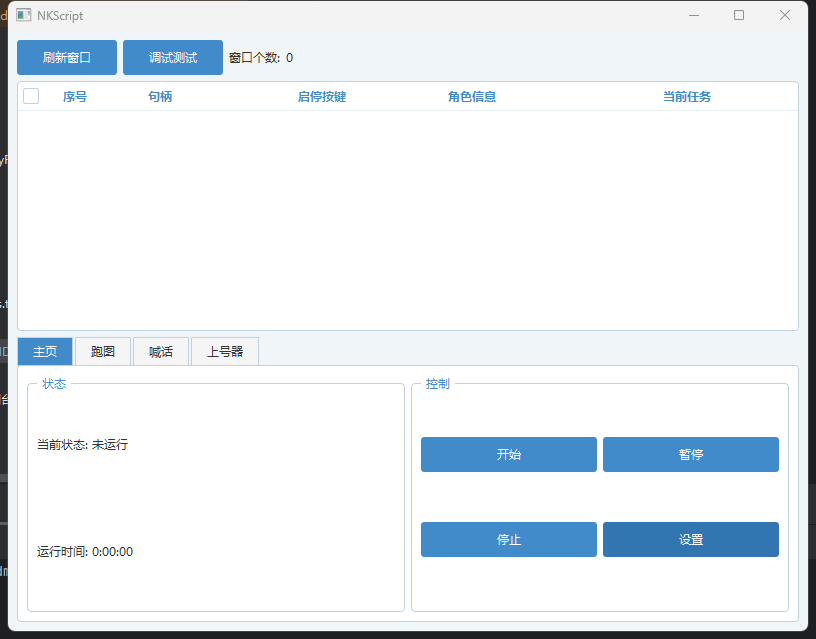
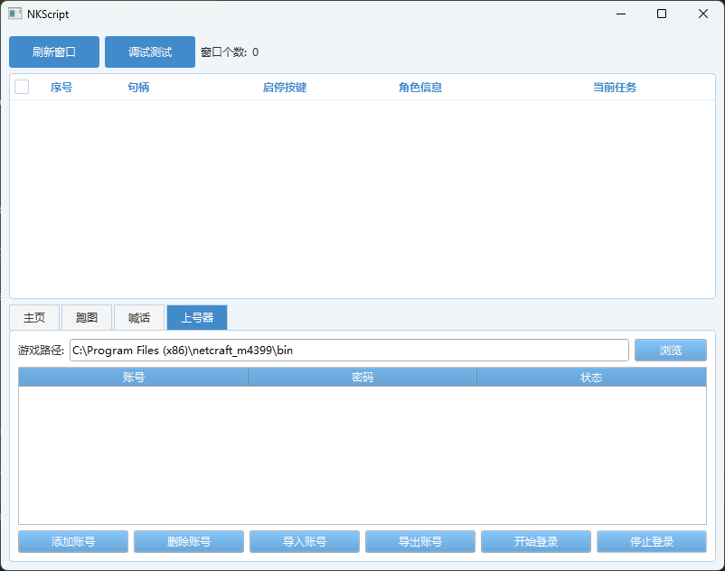

# NKScript

NKScript 是一个基于 Qt 开发的游戏辅助工具，提供多种自动化功能。

## 功能特点

- **多窗口支持**
  - 支持同时操作多个游戏窗口
  - 实时窗口状态监控
  - 智能窗口检测与绑定

- **自动化功能**
  - 自动跑图
  - 自动喊话
  - 内存功能
    - 秒矿/秒矿间隔
    - 水下呼吸
    - 死亡秒活
    - 层级透视
    - 传送秒进
  - 账号管理与自动登录

## 系统要求

- Windows 操作系统
- 管理员权限运行
- Visual Studio 2022 或更高版本
- Clion 2024.3.11
- Qt 5.15.2
- CMake 3.28 或更高版本

## 构建说明

1. 克隆项目：
```bash
git clone https://github.com/BigWhite666/NKScript.git
cd NKScript
```

2. 配置 Qt 环境：
   - 安装 Qt 5.15.2
   - 设置 Qt 环境变量

3. 使用 CMake 构建

## 使用说明

1. 以管理员身份运行程序
2. 点击"刷新窗口"获取游戏窗口列表
3. 选择需要操作的窗口
4. 选择功能标签页：
   - 跑图：自动跑图功能
   - 喊话：自动喊话功能
   - 内存功能：各种辅助功能
   - 上号器：账号管理与登录
5. 在相应功能页面进行设置并启动

## 项目结构

```
NKScript/
├── include/                # 头文件
│   ├── dm/               # 大漠插件相关
│   ├── MemoryRead/      # 内存读写
│   ├── Script/          # 功能脚本
│   ├── UI/              # 界面相关
│   └── Util/            # 工具类
├── src/                  # 源文件
│   ├── dm/
│   ├── MemoryRead/
│   ├── Script/
│   ├── UI/
│   └── Util/
├── external/            # 外部依赖
└── CMakeLists.txt      # CMake 配置文件
```

## 依赖项

- Qt 5.15.2
- 大漠插件
- Windows SDK

## 注意事项

- 本程序需要管理员权限运行
- 使用前请确保已选择正确的游戏窗口
- 如遇问题请查看程序日志输出

## 许可证

[MIT License](LICENSE)

## 贡献

欢迎提交 Issue 和 Pull Request。

## 免责声明

本项目仅供学习交流使用，请勿用于商业用途。使用本项目造成的任何后果由使用者自行承担。



```

